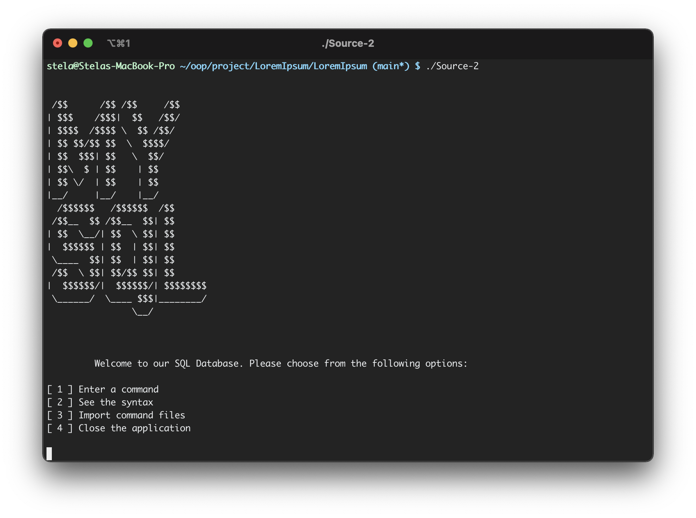

# SQL Database Simulator

> A C++ program which claims the principles of object-oriented programming.

  This project simulates a SQL database by either receiving commands from the console, or from a file passed as an argument to the program. The commands are `case-sensitive`, and while all the keywords are written in uppercase, the name of the tables and columns will be written in lowercase. The input types have been narrowed down to `integer, float, text`.
  As soon as the program starts, the user will be provided with a menu consisting of the following options:
- Enter a command
- Import commands from a .txt file — more specifically, the one passed as an argument
- Take a brief look at the syntax
- Close the application
  
  
 ### Examples

1. CREATE TABLE students ((id, integer, 1000, 0), (name, text, 128, ’’), (group, text,50,’1000’))
  - the program will first parse the command, then it will check if the table already exists in the the list of table names generated automatically when the first table is created, saved as a .txt file. Next, the column description will be assigned to a text file, whose name maches the one of table.
